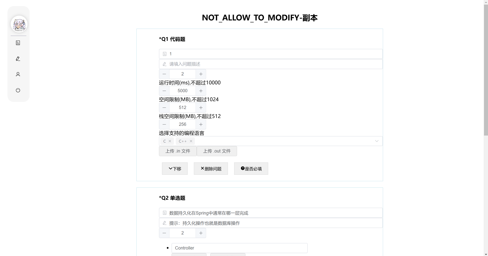
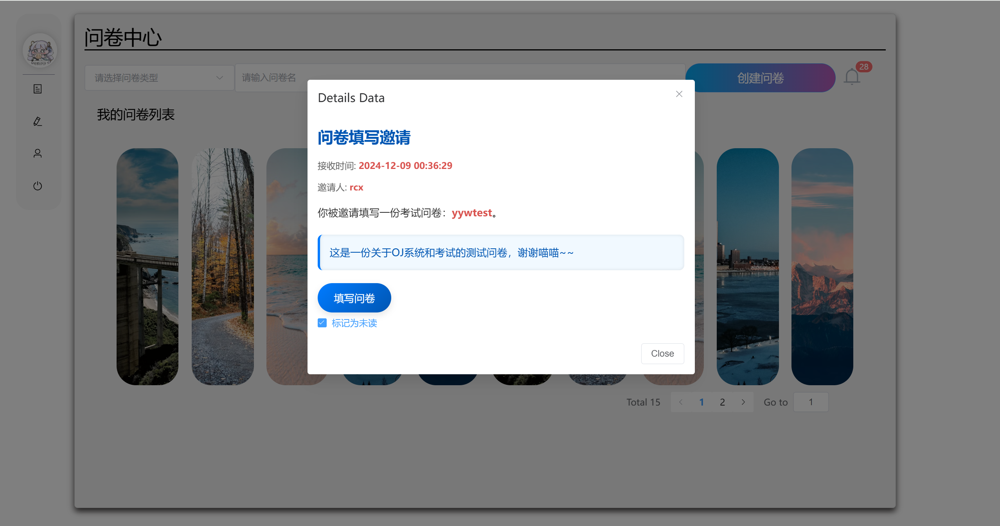
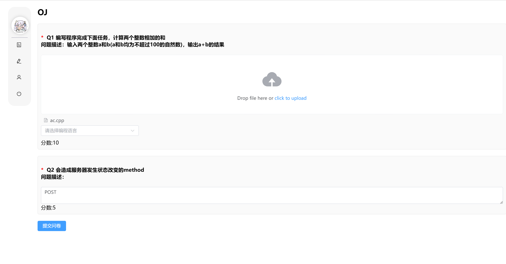
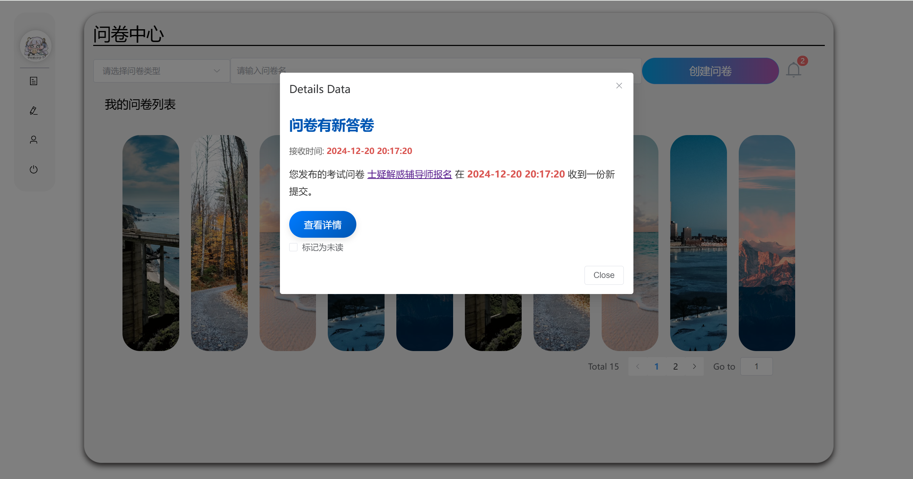
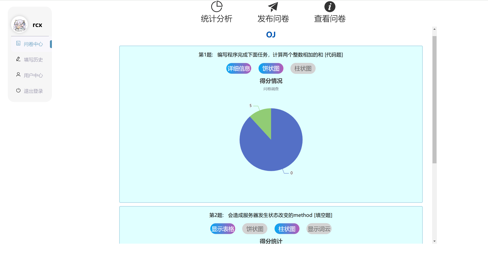
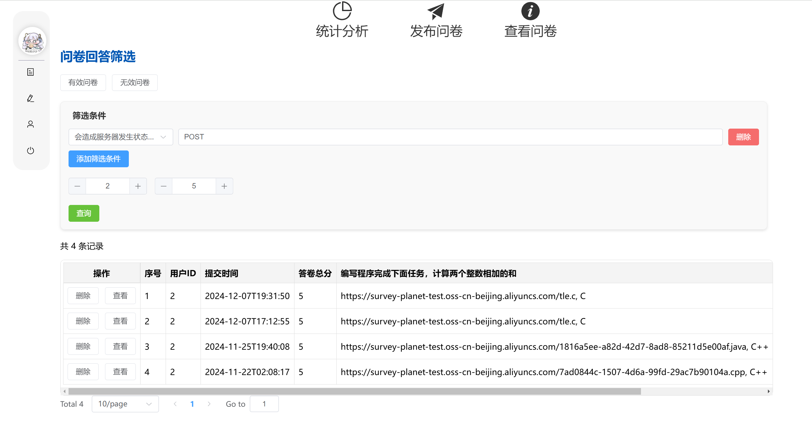

# 问卷平台 (SurveyPlanet) 

这是2024年北航计算机学院的数据库大作业，后端使用SpringBoot，前端使用vue3。

> 本仓库为SurveyPlanet的前后端仓库，如果你想要获得更多关于后端开发、部署的信息，可以关注我们的后端（服务器）仓库 [Survey-Planet-Server](https://github.com/XuanxuanRao/Survey-Planet-Server)

## 一、介绍

[SurveyPlanet](http://59.110.163.198/) 是一个轻量级的问卷平台，旨在为用户提供简便的问卷创建、发布、填写及结果分析服务。

### 总览

用户可以在平台上轻松制作问卷，选择从零开始或基于已有问卷进行编辑。问卷设计完成后可以通过多种方式发布（链接、邮件、网站内消息），在收到答卷后生成统计结果分析，同时用户可以关注订阅问卷在收到新增答卷时收到邮件/站内消息通知。

目前支持的文件类型有调查问卷和考试问卷，题目类型有单选题、多选题、填空题、文件提、代码题。代码题采用 OJ 方式，由创建者设置测试点和运行参数限制，系统会运行答卷人提交的程序生成结果。

### 功能展示

下图展示了从设计问卷到收到答卷的流程

####  设计问卷

#### 发布问卷

- 通过邮件发送问卷
  
  

- 通过站内信发送问卷
  
  用户在登录网站后会弹出消息，点击后可以查看详细信息，包括问卷发起者，邀请信息，时间等

  

#### 填写问卷

如果问卷创建者关注了该问卷，则会收到站内消息通知，创建者可以通过通知查看新答卷情况

#### 统计分析

## 二、项目结构

SurveyPlanet 采用前后端分离的方式进行开发，后端使用选用 Java 的 SpringBoot 框架进行开发，前端使用 vue3。

在仓库中，Frontend 目录下是前端的所有代码，按照标准 vue 项目流程启动即可；Backend 目录下是后端的所有代码以及数据库设计文档；docs 下存放的是项目的功能文档和设计文档。

